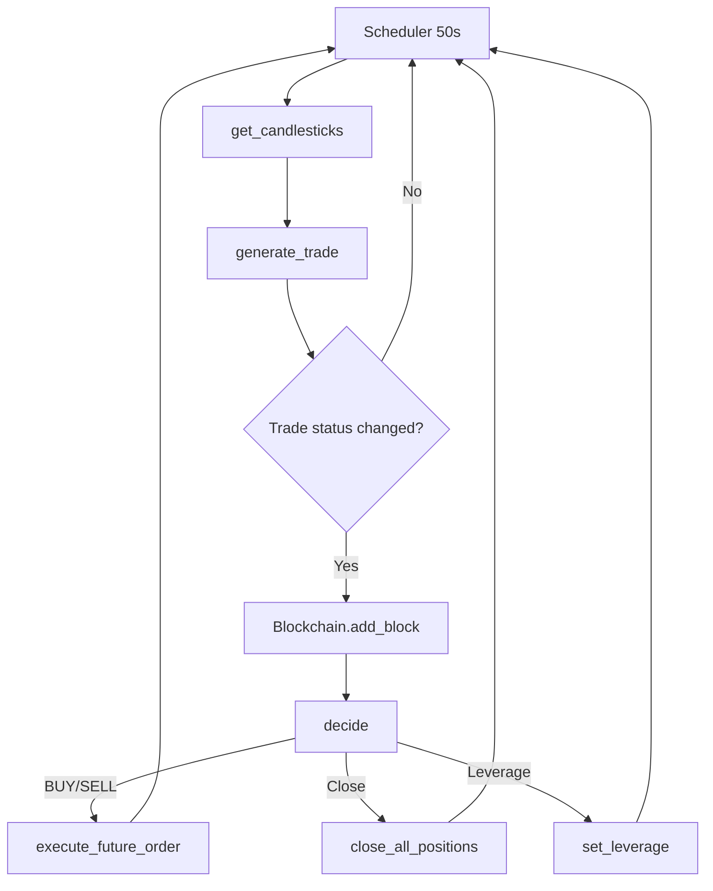
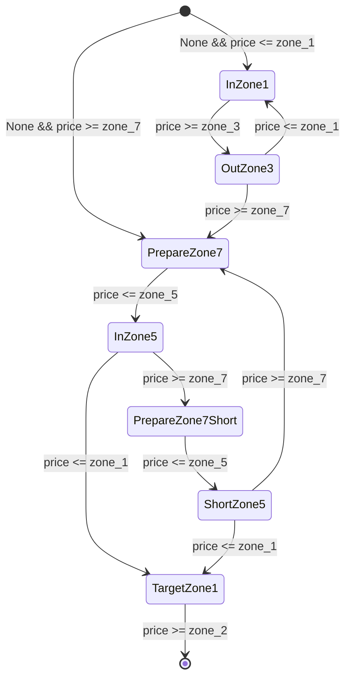

# rkd-high-frequency-trading

> A high-performance algorithmic trading platform written in **Rust**, designed for automated operations on **Binance Futures** (ETHUSDT). It exposes a REST API for control, computes technical signals with moving averages and logarithmic zones, and logs decisions on an internal blockchain-like structure for auditability.

---

## Table of Contents

* [Overview](#overview)
* [Architecture](#architecture)
* [Strategy](#strategy)
* [Flowchart](#flowchart)
* [Tech Stack](#tech-stack)
* [Installation](#installation)
* [Configuration](#configuration)
* [Running](#running)
* [HTTP API](#http-api)
* [Security Best Practices](#security-best-practices)
* [Roadmap](#roadmap)
* [Contributing](#contributing)
* [License](#license)

---

## Overview

This bot operates on a **50-second schedule**, fetching recent candlesticks from Binance Futures and computing:

* **Two moving averages**: short-term and long-term.
* **Logarithmic zones** based on the price range.
* **Market bias** (Bullish, Bearish, or None).

Decisions such as opening or closing positions and adjusting leverage are taken automatically based on a predefined **finite state machine**, and all trades are recorded immutably on an in-memory **blockchain**.

> **Disclaimer**: This project is for educational purposes only. Use at your own risk.

---

## Architecture

* **Actix-Web**: Asynchronous HTTP server.
* **Tokio**: Scheduler and runtime.
* **Reqwest + HMAC-SHA256**: Secure requests to Binance.
* **OnceCell**: Lazy-loaded singletons for configuration, credentials, and the blockchain.
* **Mutex**: Thread-safe access to the blockchain.

```
├── src
│   ├── api.rs            # REST endpoints
│   ├── balance.rs        # Fetches Binance Futures balance
│   ├── blockchain.rs     # In-memory blockchain to record trades
│   ├── client.rs         # Candlestick data and filters
│   ├── config.rs         # Loads Settings.toml
│   ├── credential.rs     # API key and secret management
│   ├── decide.rs         # Core decision engine
│   ├── dto.rs            # Data models and enums
│   ├── leverage.rs       # Adjusts trading leverage
│   ├── order.rs          # Order execution and closing
│   ├── schedule.rs       # Periodic candle fetch and decision loop
│   ├── trade.rs          # Trade generation and moving average logic
│   └── main.rs           # App bootstrap
└── config/Settings.toml  # Binance configuration
```

---

## Strategy

### 1. Moving Averages

* **CMA**: Moving average of the last 200 candles (from a total of 224).
* **OMA**: Moving average of the first 200 candles.

### 2. Bias

* **Bullish**: CMA > OMA
* **Bearish**: CMA < OMA
* **None**: CMA == OMA

### 3. Logarithmic Price Zones

* Zones Z1 through Z7 are computed between `min(low)` and `max(high)`.
* Logarithmic scaling ensures relative (percentage-based) sensitivity.

### 4. State Machine

* Each `TradeStatus` (e.g., `PrepareZone1`, `InZone3`, `TargetZone7`) defines specific transitions.
* These states dictate whether to:

  * Open a `BUY` or `SELL` order.
  * Close existing positions.
  * Adjust leverage (1x or 2x).

### 5. Risk Management

* Orders only placed if notional value ≥ 20 USDT.
* Leverage adjusted automatically.

---

## Flowchart



---

## Truth Tables

These tables describe how trade states (`TradeStatus`) transition based on the current price position within the logarithmic zones, for both **Bullish** and **Bearish** market biases.

### 📈 Bullish Status Transitions

| #  | Previous Status           | `current_price` condition               | New Status                |
|----|---------------------------|------------------------------------------|---------------------------|
| 1  | `None`                    | `>= zone_7`                              | `InZone7`                 |
| 2  | `None`                    | `<= zone_1`                              | `PrepareZone1`           |
| 3  | `OutZone5`                | `>= zone_7`                              | `InZone7`                 |
| 4  | `InZone7`                 | `> zone_5`                               | `InZone7`                 |
| 5  | `InZone7`                 | `<= zone_5`                              | `OutZone5`                |
| 6  | `OutZone5`                | `< zone_7` and `> zone_1`               | `OutZone5`                |
| 7  | `OutZone5`                | `<= zone_1`                              | `PrepareZone1`           |
| 8  | `PrepareZone1`           | `< zone_3`                               | `PrepareZone1`           |
| 9  | `PrepareZone1`           | `>= zone_3`                              | `InZone3`                 |
| 10 | `InZone3`                 | `>= zone_7`                              | `TargetZone7`        |
| 11 | `InZone3`                 | `< zone_7` and `> zone_1`               | `InZone3`                 |
| 12 | `InZone3`                 | `<= zone_1`                              | `PrepareZone1Long`       |
| 13 | `PrepareZone1Long`       | `< zone_3`                               | `PrepareZone1Long`       |
| 14 | `PrepareZone1Long`       | `>= zone_3`                              | `LongZone3`               |
| 15 | `LongZone3`              | `> zone_1` and `< zone_7`              | `LongZone3`               |
| 16 | `LongZone3`              | `<= zone_1`                              | `PrepareZone1`           |
| 17 | `LongZone3`              | `>= zone_7`                              | `TargetZone7`        |
| 18 | `TargetZone7`        | `> zone_6`                               | `TargetZone7`        |
| 19 | `TargetZone7`        | `<= zone_6`                              | `None`                    |

### 📉 Bearish Status Transitions

| #  | Previous Status           | `current_price` condition               | New Status                |
|----|---------------------------|------------------------------------------|---------------------------|
| 1  | `None`                    | `<= zone_1`                              | `InZone1`                 |
| 2  | `None`                    | `>= zone_7`                              | `PrepareZone7`           |
| 3  | `OutZone3`                | `<= zone_1`                              | `InZone1`                 |
| 4  | `InZone1`                 | `< zone_3`                               | `InZone1`                 |
| 5  | `InZone1`                 | `>= zone_3`                              | `OutZone3`                |
| 6  | `OutZone3`                | `> zone_1` and `< zone_7`              | `OutZone3`                |
| 7  | `OutZone3`                | `>= zone_7`                              | `PrepareZone7`           |
| 8  | `PrepareZone7`           | `> zone_5`                               | `PrepareZone7`           |
| 9  | `PrepareZone7`           | `<= zone_5`                              | `InZone5`                 |
| 10 | `InZone5`                 | `<= zone_1`                              | `TargetZone1`       |
| 11 | `InZone5`                 | `> zone_1` and `< zone_7`              | `InZone5`                 |
| 12 | `InZone5`                 | `>= zone_7`                              | `PrepareZone7Short`      |
| 13 | `PrepareZone7Short`      | `> zone_5`                               | `PrepareZone7Short`      |
| 14 | `PrepareZone7Short`      | `<= zone_5`                              | `ShortZone5`             |
| 15 | `ShortZone5`             | `< zone_7` and `> zone_1`              | `ShortZone5`             |
| 16 | `ShortZone5`             | `>= zone_7`                              | `PrepareZone7`           |
| 17 | `ShortZone5`             | `<= zone_1`                              | `TargetZone1`       |
| 18 | `TargetZone1`       | `< zone_2`                               | `TargetZone1`       |
| 19 | `TargetZone1`       | `>= zone_2`                              | `None`                    |

---

## Trade State Diagrams

These diagrams represent the internal finite state machines (FSM) that govern transitions of `TradeStatus` based on the `bias` (Bullish or Bearish) and the current price relative to calculated logarithmic zones.

### 📈 Bullish Bias


### 📉 Bearish Bias



---

## Tech Stack

| Category       | Technology         |
| -------------- | ------------------ |
| Language       | Rust 2024 Edition  |
| Web Framework  | Actix-Web          |
| Async Runtime  | Tokio              |
| HTTP Client    | Reqwest            |
| Serialization  | Serde, serde\_json |
| Config         | `config` crate     |
| Cryptography   | hmac, sha2, hex    |
| Singleton Mgmt | once\_cell         |
| Testing        | `cargo test`       |

---

## Installation

```bash
# Clone the repository
$ git clone https://github.com/<user>/rkd-high-frequency-trading.git
$ cd rkd-high-frequency-trading

# Install Rust (if not already installed)
$ curl --proto '=https' --tlsv1.2 -sSf https://sh.rustup.rs | sh
$ rustup default stable

# Build the project
$ cargo build --release
```

### Prerequisites

| Tool    | Minimum Version |
| ------- | --------------- |
| Rust    | 1.78            |
| OpenSSL | 1.1             |

---

## Configuration

### 1. Environment Variables

```bash
export BINANCE_API_KEY="<your-api-key>"
export BINANCE_API_SECRET="<your-api-secret>"
```

### 2. Settings File: `config/Settings.toml`

```toml
[binance]
base_url      = "https://api.binance.com/api/v3"
future_url    = "https://fapi.binance.com/fapi/v1"
future_url_v2 = "https://fapi.binance.com/fapi/v2"
symbol        = "ETHUSDT"
interval      = "1h"
limit         = 271
leverage      = 1
```

> Ensure that your API keys are excluded from version control.

---

## Running

```bash
# Launch the trading bot server
$ cargo run --release

# Output
Server running at http://localhost:8080
```

---

## HTTP API

| Method | Endpoint               | Description                                          |
| ------ | ---------------------- | ---------------------------------------------------- |
| POST   | `/trades/start`        | Start the scheduler loop.                            |
| POST   | `/trades/stop`         | Stop the scheduler.                                  |
| GET    | `/trades/health-check` | Health status of the scheduler.                      |
| GET    | `/trades/chain`        | Return full blockchain with trades.                  |
| GET    | `/trades/chain/last`   | Return the most recent trade.                        |
| GET    | `/trades/balance`      | Return current USDT balance.                         |
| POST   | `/trades/order/open`   | Open a manual order (`{"side": "BUY"}` or `"SELL"`). |
| POST   | `/trades/order/close`  | Close all open positions.                            |
| PUT    | `/trades/leverage`     | Adjust current leverage.                             |

---

## Security Best Practices

* Store Binance API credentials securely.
* Restrict external access to the server using VPN/firewall.
* Test strategies in a Binance Futures **testnet** environment.
* Use notional limits to avoid accidental high-volume exposure.

---

## Roadmap

* [ ] Blockchain persistence (SQLite/PostgreSQL)
* [ ] Offline backtesting module
* [ ] Telegram/Slack notifications
* [ ] Dockerfile and Kubernetes Helm Chart

---

## Contributing

1. Fork the repository.
2. Create a feature branch: `git checkout -b feature/my-feature`
3. Commit your changes: `git commit -m 'feat: add new feature'`
4. Push to your branch: `git push origin feature/my-feature`
5. Open a Pull Request.

> Please run `cargo fmt` and `cargo clippy` before submitting PRs.

---

## License

Distributed under the **MIT License**. See the [`LICENSE`](LICENSE) file for details.

---

> Built with ♥ in Rust — performance, safety, and fun.
